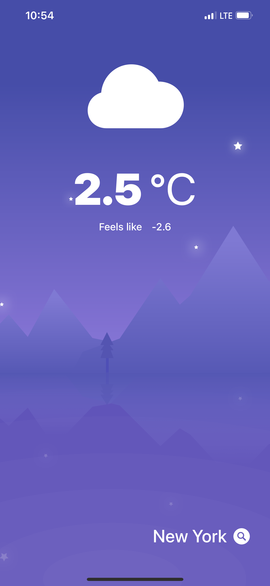
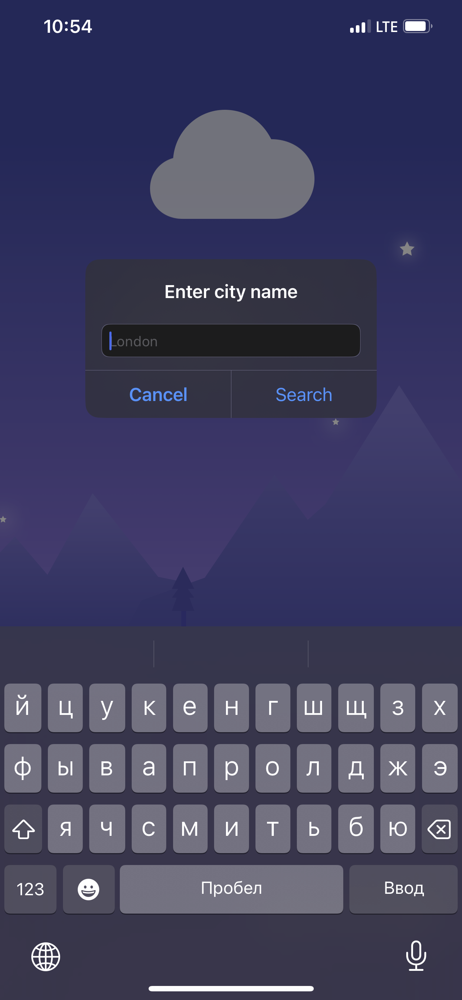
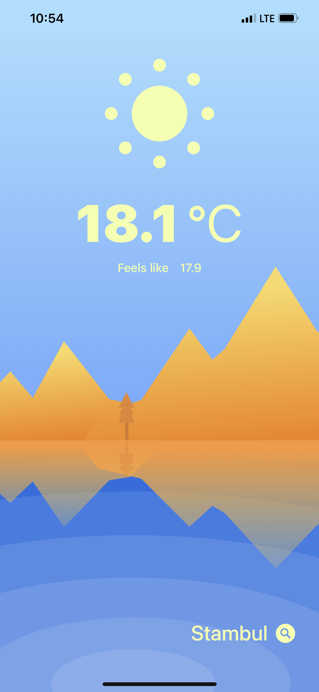

# WeatherApp

A simple application that allows you to view the weather in different cities.

- Dark and Light Mode
- Location tracking
- Different icons are displayed depending on the weather
- TextField handles multi-word names

# Technology stack

- UIKit
- Storyboard
- URLSession (OpenAPI)

# Preview

